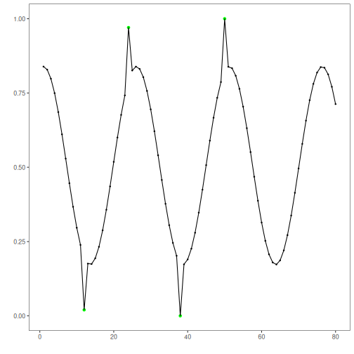
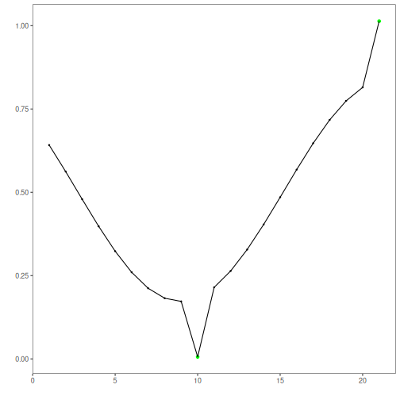
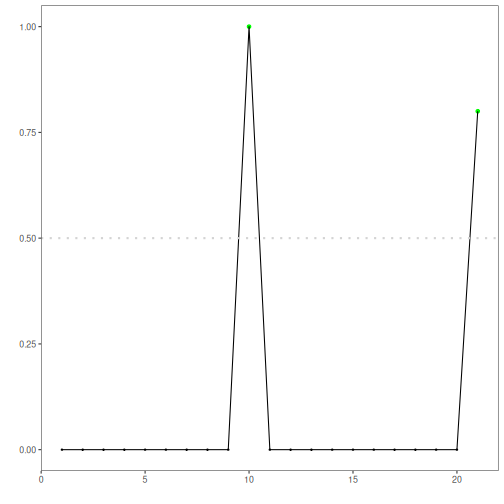

``` r
# Harbinger Package
# version 1.1.707


#loading Harbinger
library(daltoolbox)
library(harbinger) 
```


``` r
#loading the example database
data(examples_anomalies)
```


``` r
#Using the tt time series
dataset <- examples_anomalies$tt
dataset$event <- factor(dataset$event, labels=c("FALSE", "TRUE"))
head(dataset)
```

```
##       serie event
## 1 1.0000000 FALSE
## 2 0.9689124 FALSE
## 3 0.8775826 FALSE
## 4 0.7316889 FALSE
## 5 0.5403023 FALSE
## 6 0.3153224 FALSE
```


``` r
#ploting the time series
har_plot(harbinger(), dataset$serie)
```


``` r
# data preprocessing
slevels <- levels(dataset$event)

train <- dataset[1:80,]
test <- dataset[-(1:80),]

norm <- minmax()
norm <- fit(norm, train)
train_n <- transform(norm, train)
summary(train_n)
```

```
##      serie          event   
##  Min.   :0.0000   FALSE:76  
##  1st Qu.:0.2859   TRUE : 4  
##  Median :0.5348             
##  Mean   :0.5221             
##  3rd Qu.:0.7587             
##  Max.   :1.0000
```


``` r
model <- hanc_ml(cla_rf("event", slevels, mtry = 1, ntree=5))
```


``` r
# fitting the model
model <- fit(model, train_n)
detection <- detect(model, train_n)
print(detection |> dplyr::filter(event==TRUE))
```

```
##   idx event    type
## 1  12  TRUE anomaly
## 2  24  TRUE anomaly
## 3  38  TRUE anomaly
## 4  50  TRUE anomaly
```

``` r
# evaluating the training
evaluation <- evaluate(model, detection$event, as.logical(train_n$event))
print(evaluation$confMatrix)
```

```
##           event      
## detection TRUE  FALSE
## TRUE      4     0    
## FALSE     0     76
```


``` r
# ploting training results
  har_plot(model, train_n$serie, detection, as.logical(train_n$event))
```



``` r
  #plot(grf)
```


``` r
# preparing for testing
  test_n <- transform(norm, test)
```


``` r
# evaluating the detections during testing
  detection <- detect(model, test_n)

  print(detection |> dplyr::filter(event==TRUE))
```

```
##   idx event    type
## 1  10  TRUE anomaly
## 2  21  TRUE anomaly
```

``` r
  evaluation <- evaluate(model, detection$event, as.logical(test_n$event))
  print(evaluation$confMatrix)
```

```
##           event      
## detection TRUE  FALSE
## TRUE      2     0    
## FALSE     0     19
```


``` r
# ploting the results during testing
  har_plot(model, test_n$serie, detection, as.logical(test_n$event))
```



``` r
  #plot(grf)
```


``` r
# ploting the results
  har_plot(model, attr(detection, "res"), detection, test_n$event, yline = attr(detection, "threshold"))
```

```
## Warning in Ops.factor(event, (event != detection_event)): '&' not meaningful for factors
```



``` r
  #plot(res)
```
