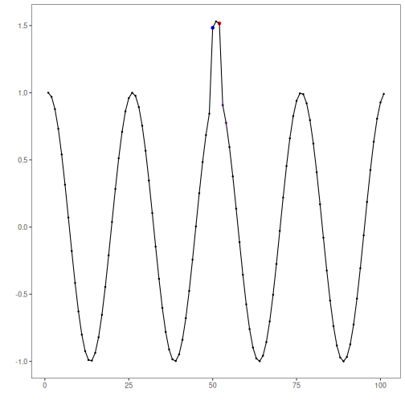
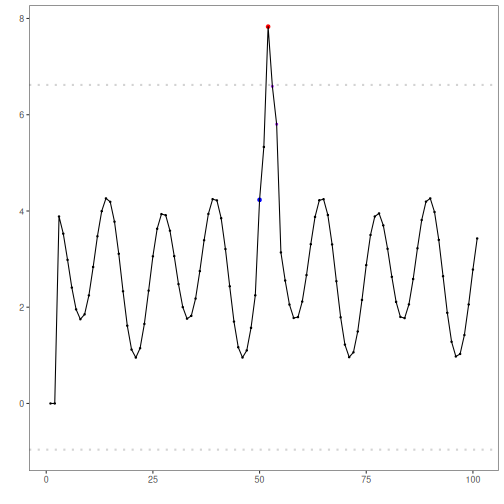

``` r
# Harbinger Package
# version 1.1.707


#loading Harbinger
library(daltoolbox)
library(harbinger) 
```


``` r
#loading the example database
data(examples_anomalies)
```


``` r
#Using the sequence time series
dataset <- examples_anomalies$sequence
head(dataset)
```

```
##       serie event
## 1 1.0000000 FALSE
## 2 0.9689124 FALSE
## 3 0.8775826 FALSE
## 4 0.7316889 FALSE
## 5 0.5403023 FALSE
## 6 0.3153224 FALSE
```


``` r
#ploting the time series
har_plot(harbinger(), dataset$serie)
```


``` r
# establishing kmeans method 
  model <- hanct_kmeans(3)
```


``` r
# fitting the model
  model <- fit(model, dataset$serie)
```


``` r
# making detections of discords using kmeans
  detection <- detect(model, dataset$serie)
```

```
## Warning in obj$anomalies[obj$non_na] <- anomalies: number of items to replace is not a multiple of replacement length
```

```
## Warning in obj$res[obj$non_na] <- res: number of items to replace is not a multiple of replacement length
```


``` r
# filtering detected events
  print(detection |> dplyr::filter(event==TRUE))
```

```
##   idx event    type seq seqlen
## 1  51  TRUE discord   3      3
```


``` r
# evaluating the detections
  evaluation <- evaluate(model, detection$event, dataset$event)
  print(evaluation$confMatrix)
```

```
##           event      
## detection TRUE  FALSE
## TRUE      0     1    
## FALSE     1     99
```


``` r
# ploting the results
  har_plot(model, dataset$serie, detection, dataset$event)
```



``` r
  #plot(grf)
```


``` r
# ploting the results
  har_plot(model, attr(detection, "res"), detection, dataset$event, yline = attr(detection, "threshold"))
```



``` r
  #plot(res)
```
