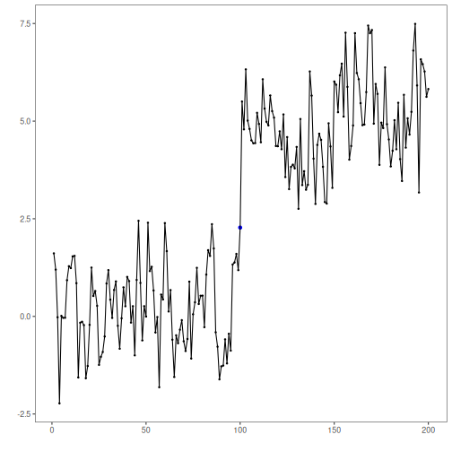
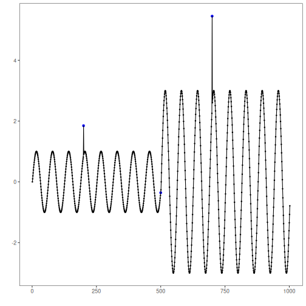

``` r
# Harbinger Package
# version 1.0.787


#loading Harbinger
library(daltoolbox)
library(harbinger) 
```


``` r
#loading the example database
data(examples_changepoints)
model <- harbinger()
```


``` r
#Using the simple time series 
dataset <- examples_changepoints$simple
model <- fit(model, dataset$serie)
detection <- detect(model, dataset$serie)
har_plot(model, dataset$serie, detection, dataset$event)
```


``` r
#plot(grf)
```


``` r
#Using the sinusoidal time series
dataset <- examples_changepoints$sinusoidal
model <- fit(model, dataset$serie)
detection <- detect(model, dataset$serie)
har_plot(model, dataset$serie, detection, dataset$event)
```


``` r
#plot(grf)
```


``` r
#Using the incremental time series
dataset <- examples_changepoints$incremental
model <- fit(model, dataset$serie)
detection <- detect(model, dataset$serie)
har_plot(model, dataset$serie, detection, dataset$event)
```


``` r
#plot(grf)
```


``` r
#Using the abrupt time series 
dataset <- examples_changepoints$abrupt
model <- fit(model, dataset$serie)
detection <- detect(model, dataset$serie)
har_plot(model, dataset$serie, detection, dataset$event)
```

```
## Don't know how to automatically pick scale for object of type <ts>. Defaulting to continuous.
```



``` r
#plot(grf)
```


``` r
#Using the volatility time series
dataset <- examples_changepoints$volatility
model <- fit(model, dataset$serie)
detection <- detect(model, dataset$serie)
har_plot(model, dataset$serie, detection, dataset$event)
```

```
## Don't know how to automatically pick scale for object of type <ts>. Defaulting to continuous.
```


``` r
#plot(grf)
```


``` r
#Using the increasing_amplitude time series
dataset <- examples_changepoints$increasing_amplitude
model <- fit(model, dataset$serie)
detection <- detect(model, dataset$serie)
har_plot(model, dataset$serie, detection, dataset$event)
```



``` r
#plot(grf)
```


``` r
#Using the complex time series
dataset <- examples_changepoints$complex
model <- fit(model, dataset$serie)
detection <- detect(model, dataset$serie)
har_plot(model, dataset$serie, detection, dataset$event)
```


``` r
#plot(grf)
```

